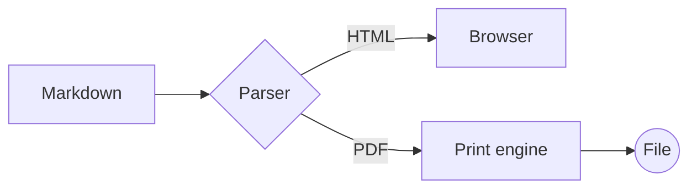
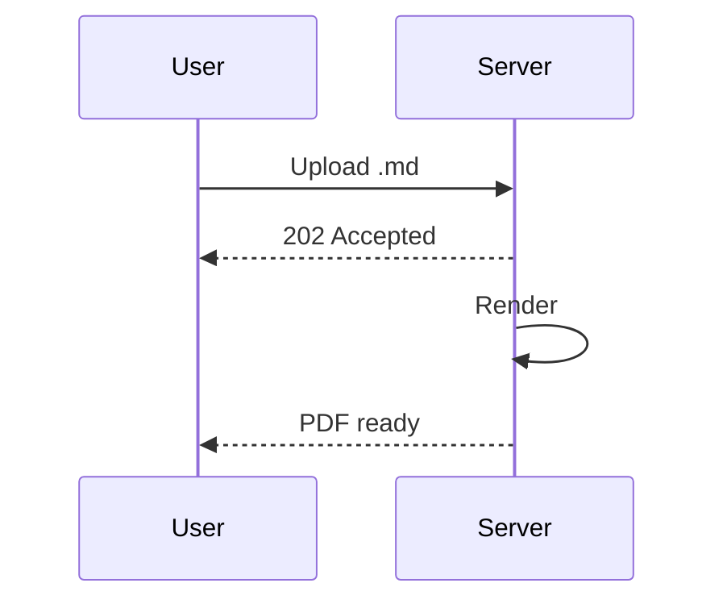
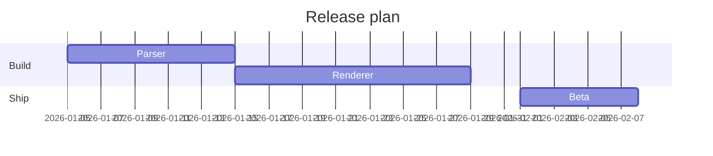

<!-- What we test: Mermaid code blocks must become diagrams (vector, not blurry), not be printed as source code. Large diagrams must fit the page width. -->

# 12 · Mermaid diagrams

```mermaid
flowchart LR
  A[Markdown] --> B{Parser}
  B -->|HTML| C[Browser]
  B -->|PDF| D[Print engine]
  D --> E((File))
```

```mermaid
sequenceDiagram
  participant U as User
  participant S as Server
  U->>S: Upload .md
  S-->>U: 202 Accepted
  S->>S: Render
  S-->>U: PDF ready
```

```mermaid
gantt
  dateFormat YYYY-MM-DD
  title Release plan
  section Build
  Parser    :a1, 2026-01-05, 10d
  Renderer  :after a1, 14d
  section Ship
  Beta      :2026-02-01, 7d
```
